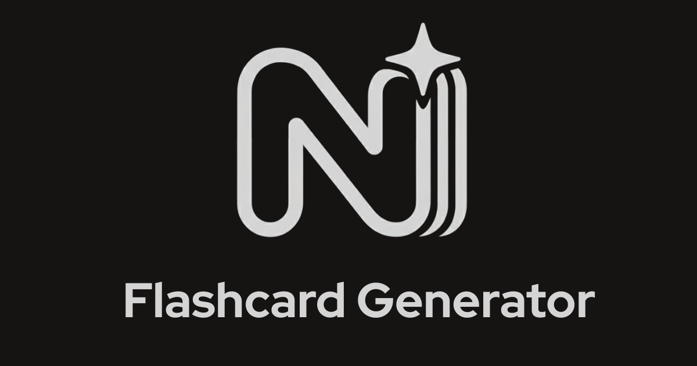
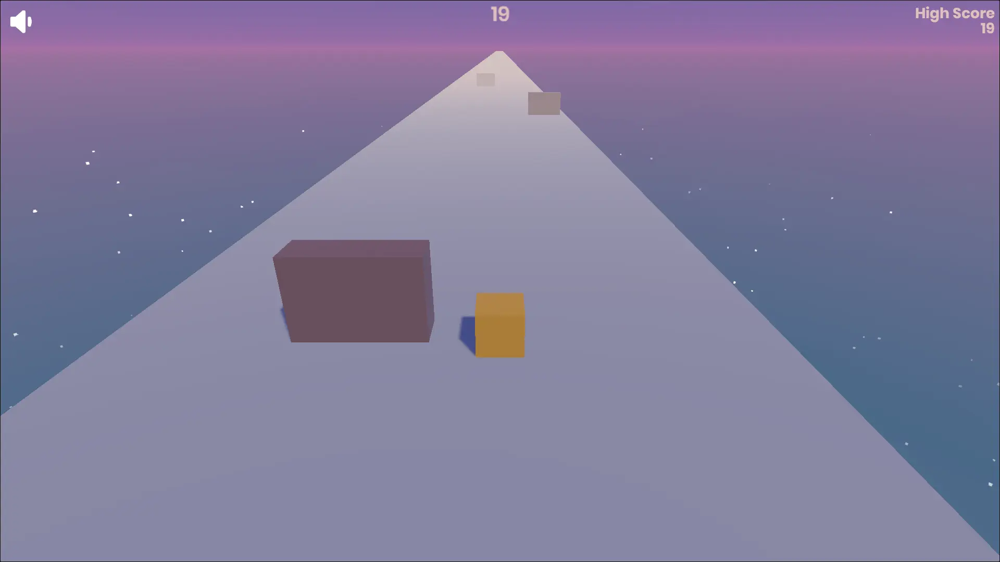

  <h1 align="center">
    Hi there, I'm Rutwik Muley
    
  </h1>
  <h2 align="center">
    <b>AI Engineer & Web Developer</b>
  </h2>
  <h3 align="center">
    Published IEEE Researcher specializing in NLP, Python, and building production-ready AI applications.
  </h3>

 

  
  
  
  
  

 

---

### 🚀 My Featured Projects

Here are a few of the key projects I've built, from AI-powered SaaS to published NLP research.

<table width="100%">
  <tr>
    <td width="50%" valign="top" align="center">
      <h3 align="center">NoteDeck (AI Study App)</h3>
       
      
        
      
A full-stack, AI-powered web application that generates interactive flashcards from user notes, PDFs, and web articles using <strong>Google's Gemini AI</strong> to enhance learning efficiency.

      

        <a href="https://www.note-deck.app/" target="_blank"><b>View Live App &rarr;</b></a>
      

    </td>
    <td width="50%" valign="top" align="center">
      <h3 align="center">Gondi WordNet (MahaDict)</h3>
       
      
        
      
Co-authored a lexical database for the Gondi language, contributing to linguistic preservation. This work was <strong>published at an IEEE International Conference</strong>.

      

        <a href="https://gondi-wordnet.onrender.com/" target="_blank"><b>View Live Project &rarr;</b></a>
        &nbsp;&nbsp;&bull;&nbsp;&nbsp;
        <a href="https://github.com/Rutwik-M/gondi-wordnet" target="_blank"><b>View Repo &rarr;</b></a>
      

    </td>
  </tr>
  
  <tr>
    <td width="50%" valign="top" align="center">
      <h3 align="center">Broadband Digital</h3>
       
      
        
      
A fully responsive ISP website with a custom <strong>Flask & PostgreSQL</strong> backend and an intuitive admin dashboard for managing users and plans.

      

        <a href="https://broadbanddigital.in/" target="_blank"><b>View Live Site &rarr;</b></a>
      

    </td>
    <td width="50%" valign="top" align="center">
      <h3 align="center">Datta Mandir Beed Website</h3>
       
      
        
      
A responsive, static website for Shree Datta Mandir, Beed, serving as a digital hub for devotees. It features daily Panchang calculations, online donation integration, festival updates, and temple history, built with HTML5, JavaScript, and Tailwind CSS.

      

        <a href="https://www.dattamandirbeed.org/" target="_blank"><b>View Live Site &rarr;</b></a>
      

    </td>
  </tr>
  <tr>
    <td width="50%" valign="top" align="center">
      <h3 align="center">Endless Cube Runner</h3>
       
      
        
      
Engineered a 3D endless runner game in <strong>Unity3D and C#</strong>, handling everything from physics to UI. Deployed on Itch.io.

      

        <a href="https://ruts558.itch.io/endless-cube-runner" target="_blank"><b>Play on Itch.io &rarr;</b></a>
      

    </td>
  </tr>
</table>
 

---

### 🛠️ My Toolkit

These are the core technologies I work with, from AI to deployment.

  
  
  
  
  
  
  
  
  
  
  
  
  
  
  

 

---

### 🏆 Certifications, Awards, & Activity

<table>
  <tr>
    <td width="60%" valign="top">
      <h4>My Key Achievements</h4>
      <ul>
        <li>
          📄 <strong>Gondi WordNet Paper Presentation</strong>
           
          <em>Certificate of Recognition for presenting my research paper at the IEEE ICAIQSA International Conference 2024.</em>
        </li>
        <li>
          🎓 <strong>NPTEL "E-Business" (Elite)</strong>
           
          <em>Achieved an "Elite" certificate in the 12-week NPTEL course from IIT Kharagpur.</em>
        </li>
        <li>
          💻 <strong>Shardeum PayFi Builder Sprint (Hackathon)</strong>
           
          <em>Received a Certificate of Appreciation for my contributions to the Shardeum hackathon.</em>
        </li>
        <li>
          🥇 <strong>ELECTRICA-2K24 "Virtual Campus" (2nd Prize)</strong>
           
          <em>Won 2nd prize in a competitive tech-fest event for building a virtual campus.</em>
        </li>
        <li>
          🥇 <strong>RADIANCE "Model Making" (3rd Prize)</strong>
           
          <em>Won 3rd prize in a technical model making event.</em>
        </li>
      </ul>
    </td>
    <td width="40%" valign="top">
      <h4>My GitHub Activity</h4>
      

        
          
        
          
        

          <i>Note: My commit/PR stats are not public as my most significant work is in private repositories. My contribution graph reflects my full activity.</i>
        

      

    </td>
  </tr>
</table>

 
