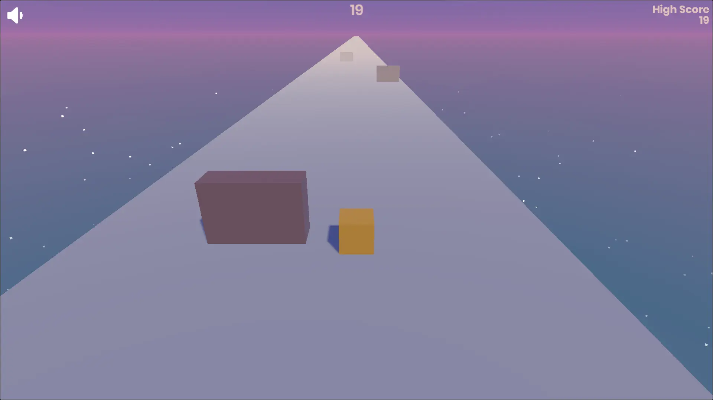

  <h1 align="center">
    Hi there, I'm Rutwik Muley
    
  </h1>
  <h2 align="center">
    <b>AI Engineer & Web Developer</b>
  </h2>
  <h3 align="center">
    Published IEEE Researcher · NLP · Python · Production-Ready AI Applications
  </h3>

 

  
  &nbsp;
  
  &nbsp;
  
  &nbsp;
  
  &nbsp;
  

 

---

## 🚀 Featured Projects

<table width="100%">
  <tr>
    <td width="50%" valign="top" align="center">
      <h3>🧠 Slate — AI Habit Tracker</h3>
       
      
        
      

        A gamified habit tracker with a <strong>RAG-powered AI coach</strong> built for Code Canvas Hackathon @ Medicaps University. The AI embeds your habit history into vectors and uses cosine similarity search — so instead of generic advice, you get coached on <em>your actual data</em>.
      

      

        XP system · Streak milestones (7/30/100 days) · GitHub-style heatmap · Pomodoro timer · Goal grouping · Shareable achievement cards · Groq responses in &lt;500ms
      

      

        
        
        
        
        
      

      

        <a href="https://zenith-eta-ruddy.vercel.app" target="_blank"><b>View Live App →</b></a>
      

    </td>
    <td width="50%" valign="top" align="center">
      <h3>📚 NoteDeck — AI Study SaaS</h3>
       
      
        
      

        Full-stack AI study platform generating interactive flashcards from PDFs, DOCX, and web articles. Scaling with <strong>350+ active learners</strong>, <strong>614 custom decks</strong>, and <strong>8,751 flashcards</strong> generated organically in ~90 days.
      

      

        Three-tier Razorpay monetization (INR/USD geo-pricing) · D2L Brightspace quiz export · RAG synthesis pipeline
      

      

        
        
        
        
      

      

        <a href="https://www.note-deck.app/" target="_blank"><b>View Live App →</b></a>
      

    </td>
  </tr>

  <tr>
    <td width="50%" valign="top" align="center">
      <h3>🔬 Gondi WordNet (MahaDict)</h3>
       
      
        
      

        Co-authored a lexical database for the endangered Gondi language, contributing to linguistic preservation. Custom tokenization/lemma pipelines for sparse datasets. <strong>Published at IEEE ICAIQSA International Conference 2024.</strong>
      

      

        
        
        
        
      

      

        <a href="https://gondi-wordnet.onrender.com/" target="_blank"><b>Live →</b></a>
        &nbsp;·&nbsp;
        <a href="https://ieeexplore.ieee.org/document/10882401" target="_blank"><b>IEEE Paper →</b></a>
      

    </td>
    <td width="50%" valign="top" align="center">
      <h3>📡 Broadband Digital</h3>
       
      
        
      

        Full-stack ISP platform with a custom Flask+PostgreSQL admin dashboard for managing users and plans, and integrated payment gateway increasing online sales conversion.
      

      

        
        
        
        
      

      

        <a href="https://broadbanddigital.in/" target="_blank"><b>View Live Site →</b></a>
      

    </td>
  </tr>

  <tr>
    <td width="50%" valign="top" align="center">
      <h3>🛕 Shree Datta Mandir Platform</h3>
       
      
        
      

        High-performance platform with a proprietary <strong>FinTech layer</strong>. Smart UPI payment routing, compliance automations, and serverless edge compute for near-zero server costs at scale.
      

      

        
        
        
      

      

        <a href="https://www.dattamandirbeed.org/" target="_blank"><b>View Live Site →</b></a>
      

    </td>
    <td width="50%" valign="top" align="center">
      <h3>🎮 Endless Cube Runner</h3>
       
      
        
      

        3D endless runner in Unity3D with efficient object pooling and collision detection for stable <strong>60 FPS in WebGL</strong>. Procedural obstacle generation ensures unique gameplay every session.
      

      

        
        
        
      

      

        <a href="https://ruts558.itch.io/endless-cube-runner" target="_blank"><b>Play on Itch.io →</b></a>
      

    </td>
  </tr>
</table>

---

## 🛠️ Tech Stack

**Languages & Frameworks**

**AI / ML**

**Data & Cloud**

**Tools & Design**

---

## 🏆 Certifications & Awards

<table width="100%">
  <tr>
    <td width="60%" valign="top">

**Key Achievements**

- 📄 **Paper Presentation — Gondi WordNet**
  Certificate of Recognition at IEEE ICAIQSA International Conference 2024

- 💻 **Code Canvas Hackathon — Slate (AI Habit Tracker)**
  Built a full-stack RAG-powered habit tracker at Medicaps University

- 🎓 **NPTEL "E-Business" (Elite)**
  12-week course from IIT Kharagpur — Elite certification

- ⛓️ **Shardeum PayFi Builder Sprint**
  Certificate of Appreciation for hackathon contributions

- 🥈 **ELECTRICA-2K24 "Virtual Campus" — 2nd Prize**
  Competitive tech-fest at GCOEN

- 🥉 **RADIANCE "Model Making" — 3rd Prize**
  Technical model making event

    </td>
    <td width="40%" valign="top" align="center">

**GitHub Activity**

  

 

<i>Most significant work is in private repositories — contribution graph reflects full activity.</i>

    </td>
  </tr>
</table>

---

## 📫 Get In Touch

| Platform | Link |
|---|---|
| 🌐 Portfolio | [rutwik-m.is-a.dev](https://rutwik-m.is-a.dev/) |
| 💼 LinkedIn | [in/rutwik-muley-b20707208](https://www.linkedin.com/in/rutwik-muley-b20707208) |
| 📧 Email | [rmuley558@gmail.com](mailto:rmuley558@gmail.com) |
| 🐙 GitHub | [@Rutwik-M](https://github.com/Rutwik-M) |
| 🔬 IEEE | [Author Profile](https://ieeexplore.ieee.org/author/481395213421455) |
| 🆔 ORCiD | [0009-0002-8628-9601](https://orcid.org/0009-0002-8628-9601) |

